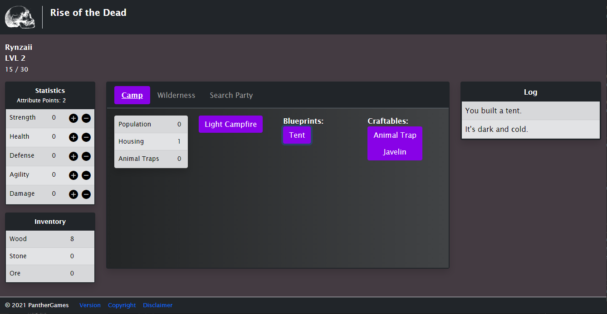

# Rise of the Dead [An apocalyptic single-player idle game.]
## Game Description
A simple text-based RPG during the apocalypse. You are a founder of a small camp waiting to build a new community. Build and craft items to build up your base defense, consumables that boost your stats, and equipment to, of course, kill zombies! 

How will you restore humanity?
Wiki link
# Screenshots
## Camp

## Wilderness

## Raid Party

 

<!-- hi-->
